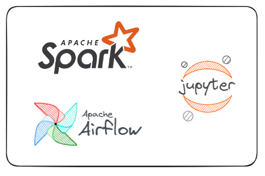
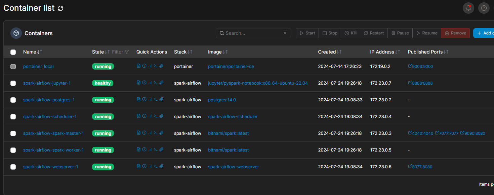
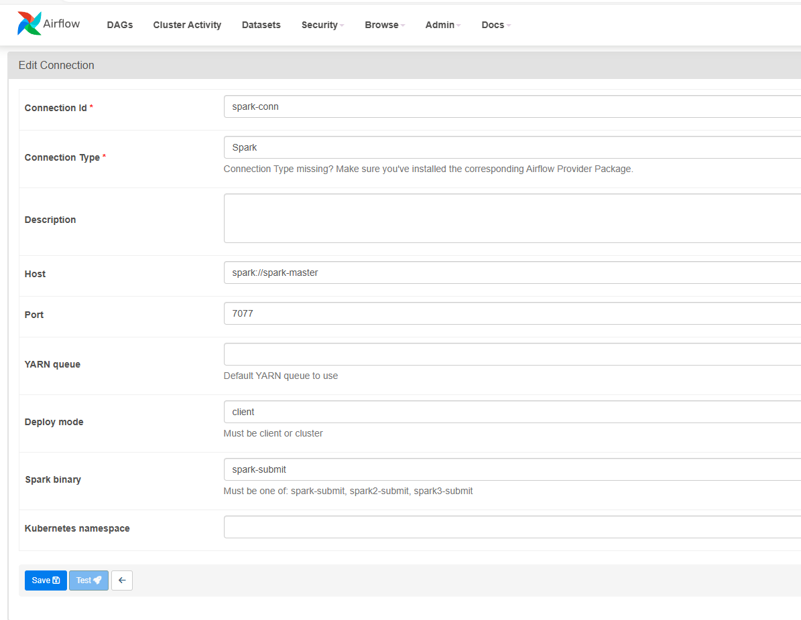
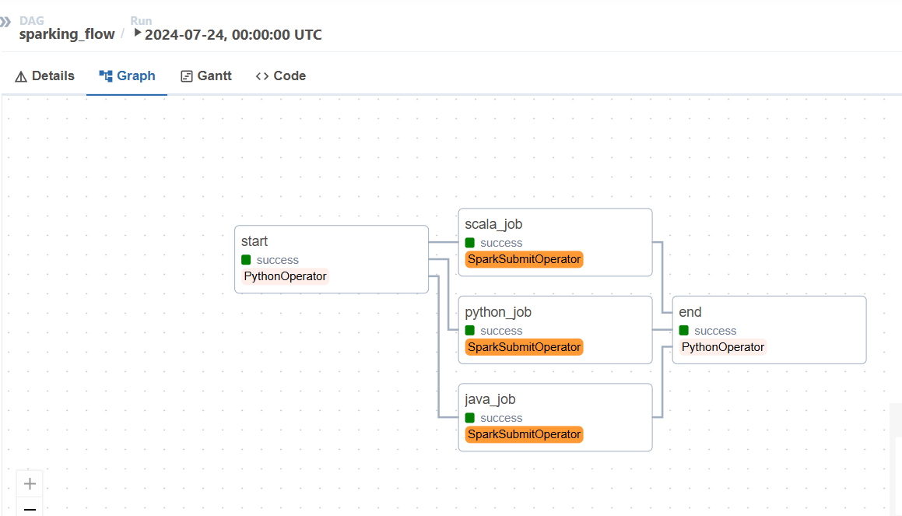

# Airflow + Spark + Jupyter

## Arquitetura


## Pré-requisitos
* Docker

## Como instalar o Docker?

https://www.youtube.com/playlist?list=PLbPvnlmz6e_L_3Zw_fGtMcMY0eAOZnN-H

## Como usar as ferramentas?
Step 1 --> Faça clone do projeto 
```
git clone https://github.com/wlcamargo/spark-airflow
```
Step 2 --> Entre na pasta do projeto
```
cd spark-airflow
```
Step 3 --> Baixe as imagens e rode os containers
```
sudo docker compose up -d --build
```

sample container running:


## Como acessar os serviços?

spark-master: localhost:9090
jupyter: localhost:8888 (token)
airflow: localhost:8077 (login:admin / password:admin)

### Pegar o Token do Jupyter
```
docker exec -it <id container jupyter> /bin/bash
```
```
jupyter notebook list
```

### Como usar o Airflow?
Step 1 --> Crie uma conexão com o Spark-Master



Step 2 --> Execute a DAG



## Conclusão
Parabéns! o seu ambiente de Spark com Airflow e Jupyter já está pronto para o uso.

## Referências

https://www.youtube.com/watch?v=o_pne3aLW2w&t=2580s

https://github.com/airscholar/SparkingFlow

## Desenvolvedor

| Desenvolvedor      | LinkedIn                                   | Email                        | Portfólio                              |
|--------------------|--------------------------------------------|------------------------------|----------------------------------------|
| Wallace Camargo    | [LinkedIn](https://www.linkedin.com/in/wallace-camargo-35b615171/) | wallacecpdg@gmail.com        | [Portfólio](https://wlcamargo.github.io/)   |

